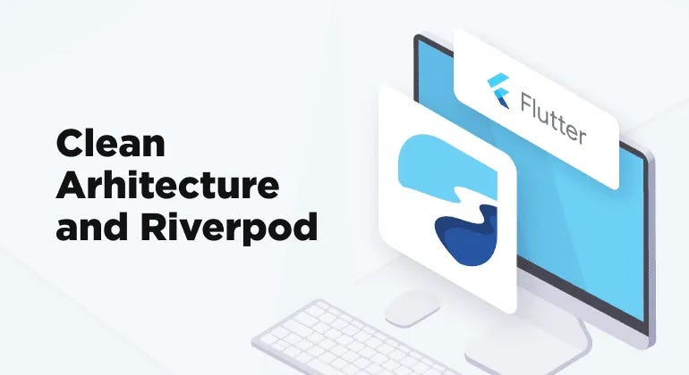

# 🧱 Clean Architecture with Riverpod in Flutter

This project demonstrates how to structure a Flutter app using **Clean Architecture** principles and **Riverpod** for state management and dependency injection.

---

## 📐 Project Structure (Clean Architecture)

## 🔄 Folder Responsibility

| Layer         | Responsibility                                  |
|---------------|--------------------------------------------------|
| `core/`       | Shared constants, utilities, network handler     |
| `data/`       | Connects app to external sources (e.g., APIs)    |
| `domain/`     | Pure business logic — use cases and entities     |
| `presentation/` | UI layer & ViewModels (Riverpod providers)    |

---